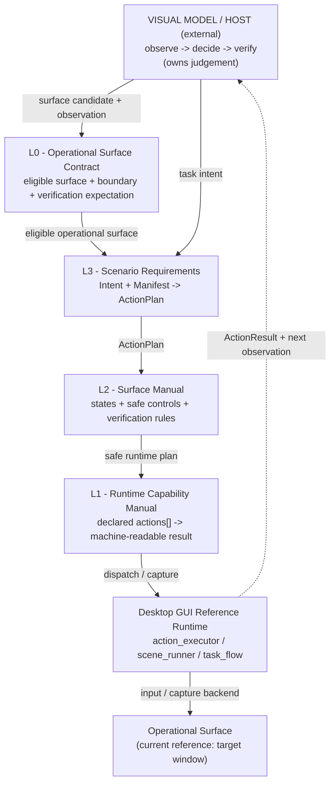

# OVERVIEW - visual-agent Protocol Map (Agent-Facing)

- Audience: AI agents (planners, code editors, reviewers). For humans, start at `../README.md`.
- Status: Normative map for the current tracked public surface.
- Reading mode: this file fuses prose with YAML so agents can orient quickly.
- Authority rule: the root files (`AGENTS.md`, `README.md`, `README.zh-CN.md`) define public
  positioning and P0 scope. Per-layer protocol files define current desktop GUI reference-runtime
  behavior.

## 0. What This Document Is For

This is the protocol entry point an agent should load before planning, editing, or reviewing the
visual-agent contract. The project is **visual-agent**: a protocol-first L0/L1/L2/L3 surface,
runtime, and manual system that helps visual-model hosts safely operate software interfaces and
simple physical panels.

This file maps the root contract onto the current desktop GUI reference runtime. It does
not make the desktop GUI runtime the product boundary.

```yaml
documents:
  root_contract:
    - AGENTS.md
    - README.md
    - README.zh-CN.md
  overview: protocol/README.md
  protocol_specs:
    L0: protocol/L0-operational-surface-contract.md
    L1: protocol/L1-runtime-capability-manual.md
    L2: protocol/L2-surface-manual.md
    L3: protocol/L3-scenario-requirements.md
  integration: integration/host-embedding.md
runtime:
  desktop_gui_reference:
    L1: runtimes/desktop-gui/src/action_executor.swift
    L2: runtimes/desktop-gui/src/scene_runner.swift
    L3: runtimes/desktop-gui/src/task_flow.swift
example:
  desktop_gui_reference_surface: runtimes/desktop-gui/examples/reference-surface/
adapters:
  dir: adapters/
reference_rule:
  direction: runtime --> protocols
  on_scope_conflict: "root contract wins for product boundary and P0 scope"
  on_runtime_behavior_conflict: "protocol spec wins over code; update spec first, then code"
```

## 1. L0-L3 Layer Map

L0 is now explicit. It defines what kind of visible interface can enter the visual-agent loop at
all. L1 then describes what a runtime or adapter can observe and execute. L2 describes a concrete
surface manual for one operational surface. L3 describes scenario requirements that expand into
safe runtime action plans.

The current `runtimes/desktop-gui` implementation instantiates that model for desktop GUI windows.
Terms such as `Target Application`, `Target Window`, `Target Profile`, `AppObservation`, and
`windowTopLeft` are current desktop GUI reference-runtime terms. They are not the whole project
vocabulary.

```yaml
layers:
  L0:
    name: Operational Surface Contract
    manual: surface-eligibility-contract
    nature: project-level protocol entry
    knows:
      - operational surface boundary
      - observation frame
      - safety envelope
      - minimum verification expectation
    forbidden:
      - runtime mechanics
      - concrete app/site/device semantics
      - task intent expansion
      - robotics navigation/grasping/force/world modeling
    authority: root_contract
    spec: protocol/L0-operational-surface-contract.md
  L1:
    name: Runtime Capability Manual
    manual: runtime-capability-manual
    nature: adapter/runtime mechanism
    knows:
      - observable inputs provided by a runtime
      - executable declared actions
      - backend capabilities and limits
      - machine-readable results and errors
    forbidden:
      - operational surface semantics
      - business/task judgement
      - scenario state
    current_reference_spec: L1
  L2:
    name: Surface Manual
    manual: surface-manual
    nature: template instantiated per operational surface
    knows:
      - observed states
      - safe targets or controls
      - state-to-plan mapping
      - surface safety boundaries
      - success and failure observations
    forbidden:
      - reimplementing L1 mechanics
      - task aggregation/reporting
      - raw event dispatch
    current_reference_spec: L2
  L3:
    name: Scenario Requirements
    manual: scenario-requirements
    nature: task/scene manifest layer
    knows:
      - intent set
      - action-step templates
      - field normalization
      - state persistence
      - data anonymization where needed
    forbidden:
      - raw pointer/device/actuator events
      - runtime coordinate arithmetic as task logic
      - deciding task success without fresh observation
    current_reference_spec: L3
```

## 2. Desktop GUI Reference Runtime Bridge

The current implementation is a desktop GUI reference runtime. It proves the L0-L3 contract on
software surfaces, but it does not limit the contract to software windows.

```yaml
generic_to_current_reference:
  OperationalSurface: "Target Application window selected by bundleID/ownerNames"
  ObservationFrame: "windowTopLeft / screenTopLeft coordinate spaces"
  SurfaceManual: "current L2 Surface Manual template"
  SurfaceProfile: "current Target Profile profile.json"
  ScenarioRequirements: "current Scene Manifest manifest.json"
  RuntimeCapabilityManual: "current action_executor.swift + L1 action set"
  RuntimeResult: "ActionResult plus fresh VerificationObservation"
compatibility_note:
  current_wire_terms:
    - AppObservation
    - ActionPlan
    - ActionResult
    - VerificationObservation
  rule: "preserve current wire behavior; rename semantics before renaming APIs"
```

## 3. Architecture Diagram

The visual model / host sits outside the protocol layers. It observes, decides, and judges success.
visual-agent defines the surface contract, manuals, runtime capability boundary, action results,
and verification requirement.



```yaml
closed_loop:
  - observation
  - decision
  - declared_action
  - runtime_result
  - fresh_verification_observation
host_boundary:
  owns:
    - observation interpretation
    - decision
    - task success judgement
visual_agent_boundary:
  owns:
    - L0 surface eligibility contract
    - L1 runtime capability contract
    - L2 surface manual contract
    - L3 scenario requirements contract
    - machine-readable runtime results
dependency_invariant: "L1/L2/L3 execution dependencies run downward; every layer must respect L0; no upward judgement or hidden surface eligibility"
```

## 4. Data Contracts On The Wire

The current wire contracts are desktop GUI reference-runtime contracts. Hosts should treat them as
the stable compatibility surface for this runtime.

```yaml
messages:
  AppObservation:
    kind: appObservation
    defined_in: "L1 section 4"
    reference_note: "current desktop GUI observation shape; future generalized surface observation may wrap or extend it"
  ActionPlan:
    kind: action_plan
    defined_in: "L1 section 5"
    action_set: "L1 section 6"
  ActionResult:
    kind: action_result
    defined_in: "L1 section 11"
    rule: "ok:true means dispatched/completed at runtime boundary, not task success"
  VerificationObservation:
    kind: verificationObservation
    defined_in: "L1 section 12"
scene_artifacts:
  TargetProfile:
    defined_in: "L2 section 3 (E1)"
    file: "runtimes/desktop-gui/examples/<surface>/profile.json"
    reference_note: "desktop GUI reference profile; future Surface Profile should be L0/L2-aware"
  SceneManifest:
    defined_in: "L3 section 7 (E4)"
    file: "runtimes/desktop-gui/examples/<surface>/manifest.json"
action_set:
  required: [click, scroll, keypress, wait, screenshot]
  reserved_rejected: [type, drag, move, double_click]
host_integration:
  ErrorEnvelope: { shape: "{ok:false, kind:error, reason, message}", defined_in: "INT section 4" }
  SessionState: { flag: "--state <path>", defined_in: "INT section 5" }
  ToolsSchema: { command: "task_flow tools-schema", defined_in: "INT section 6" }
  Capabilities: { command: "action_executor capabilities", defined_in: "INT section 7" }
```

## 5. Cross-Cutting Invariants

These invariants bind the root contract, current reference specs, and runtime files.

```yaml
invariants:
  - id: l0-surface-eligibility
    rule: "a target must be a bounded operational surface before it enters L1/L2/L3"
    authority: ["AGENTS.md", "README.md", "README.zh-CN.md"]
  - id: observe-act-verify
    rule: "observe, issue a minimal declared action, then verify by fresh observation"
    authority: ["AGENTS.md", "L1 section 2", "L2 section 7", "L3 section 10"]
  - id: dispatched-not-succeeded
    rule: "ActionResult.ok:true means runtime dispatch/completion, never task success"
    authority: ["AGENTS.md", "L1 section 2.2", "L1 section 11"]
  - id: capture-usability-gate
    rule: "a successful capture is not vision-usable; gate on usableForVision; halt on unobservableWindow"
    authority: ["L1 section 10"]
  - id: active-display-reachability
    rule: "desktop GUI negative coordinates are judged by active-display containment, not sign"
    authority: ["L1 section 8"]
  - id: reserved-actions
    rule: "text/drag/move/double_click are not default desktop GUI capabilities; L1 rejects them"
    authority: ["L1 section 6.3", "L1 section 14"]
  - id: no-upward-judgement
    rule: "runtime, adapters, and executors never make visual/business/task-success judgement"
    authority: ["AGENTS.md", "L1 section 2.2", "L2 section 2", "L3 section 2", "INT section 2"]
  - id: surface-knowledge-is-data
    rule: "surface specifics live in profiles, manifests, and surface manual docs, not generic engines"
    authority: ["AGENTS.md", "L2 sections 3-8", "L3 sections 3-8"]
  - id: adapter-not-core
    rule: "browser, mobile, physical-panel, and embodied-control runtimes are adapters or forked projects unless reopened"
    authority: ["AGENTS.md", "README.md"]
  - id: machine-readable-errors
    rule: "every failure is { ok:false, kind:error, reason:<stable code>, message }; hosts branch on reason"
    authority: ["INT section 4"]
  - id: safety-approval-routed
    rule: "pending_safety_checks are surfaced to a host approver and never auto-approved"
    authority: ["INT section 8", "L1 section 8"]
```

## 6. How An Agent Should Use This Map

```yaml
playbooks:
  before_any_change:
    read:
      - AGENTS.md
      - README.md
      - README.zh-CN.md
      - protocol/README.md
      - protocol/L0-operational-surface-contract.md
    rule: "root contract decides product scope; this map routes deeper work"
  evolve_protocol_docs:
    order:
      - "keep this OVERVIEW aligned to L0-L3"
      - "keep L0 Operational Surface Contract as the protocol entry point"
      - "keep L1 distinguished between generic runtime capability and desktop GUI window binding"
      - "keep L2 framed as Surface Manual, with software terms only as desktop GUI reference terms"
      - "keep L3 framed as Scenario Requirements, with Scene Manifest only as the current runtime artifact name"
    rule: "protocol docs lead runtime binding comments"
  add_new_desktop_reference_surface:
    do_not: ["edit runtimes/desktop-gui/src/*.swift", "add surface names to engines"]
    steps:
      - "copy runtimes/desktop-gui/examples/reference-surface/ to a new surface dir"
      - "write profile.json for the desktop GUI target"
      - "write L2 surface manual notes"
      - "write manifest.json intents"
      - "if collecting data: add normalization + anonymization"
      - "validate every intent with task_flow --manifest <manifest> preview-json"
  edit_runtime_code:
    before: "read the file's AGENT BINDING BLOCK and locate cited spec sections"
    rule: "if a change alters observable behavior, update the protocol section first, then code"
    never: "make the protocol merely describe current code"
  review_change:
    check:
      - "root L0-L3 contract still holds"
      - "desktop GUI terms are framed as reference-runtime terms"
      - "no model calls or task-success judgement entered runtime/adapters"
      - "binding-block citations still point to valid sections"
  run_checks:
    typecheck:
      - "swiftc -typecheck runtimes/desktop-gui/src/action_executor.swift"
      - "swiftc -typecheck runtimes/desktop-gui/src/scene_runner.swift"
      - "swiftc -typecheck runtimes/desktop-gui/src/task_flow.swift"
    smoke: "bash runtimes/desktop-gui/scripts/smoke.sh"
```

## 7. Runtime Symbol To Spec Index

These mappings are current desktop GUI reference-runtime mappings. Update them whenever protocol
sections or runtime symbols change.

```yaml
runtime_to_spec:
  action_executor.swift:
    TargetApp: "L1 section 3 (desktop GUI target binding)"
    appObservation: "L1 sections 4, 10, and 13"
    runPlan: "L1 sections 5, 8, and 11"
    executeAction: "L1 sections 6 and 6.3"
    eventPoint: "L1 section 7"
    ensurePointerSafe: "L1 section 8"
    imageUsableForVision: "L1 section 10"
    "ActionError.reasonCode / errorEnvelope": "INT section 4"
    capabilities: "INT section 7"
  scene_runner.swift:
    "--profile / loadProfile": "L2 section 3 (desktop GUI Target Profile binding)"
    process-delegation: "L2 section 2"
    emitError: "INT section 4"
    l1Invocation: "INT section 9"
  task_flow.swift:
    loadManifest: "L3 section 7"
    resolvedIntentFields: "L3 section 6"
    "substitute / buildActions": "L3 section 4"
    actionPlan: "L3 sections 3 and 10"
    executePlan: "L3 section 2"
    "FlowError.reasonCode / errorEnvelope": "INT section 4"
    "stateOverride / --state": "INT section 5"
    "toolsSchema / toolDefinition": "INT section 6"
    l1ExecutorInvocation: "INT section 9"
```
