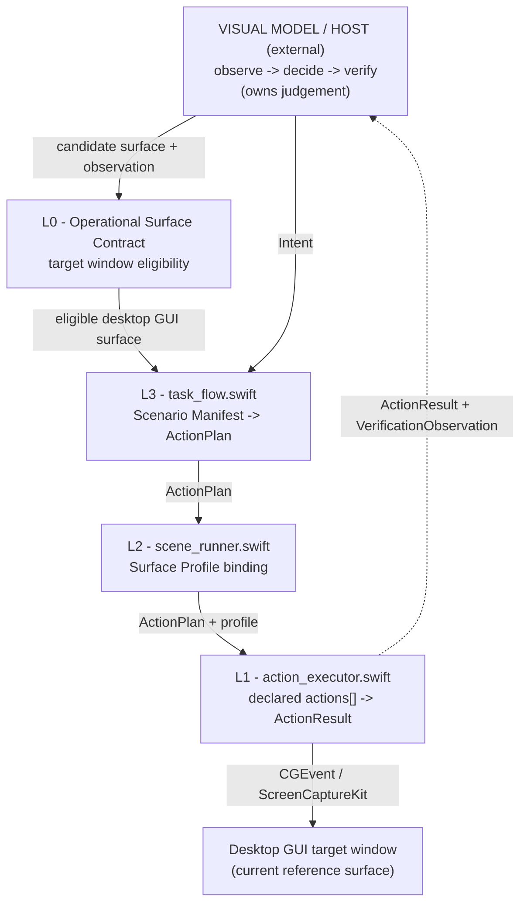

# visual-agent Desktop GUI Reference Runtime

This directory contains the first reference runtime for **visual-agent**. It instantiates the
root L0/L1/L2/L3 contract on desktop GUI operational surfaces.

The product boundary is not this directory. The product boundary is the protocol-first surface,
runtime, and manual system described by the root files:

- `../../AGENTS.md`
- `../../README.md`
- `../../README.zh-CN.md`

This runtime proves the contract on software windows. Browser, mobile, physical-panel, and
embodied-control runtimes can later implement the same contract through adapters or separate
forked projects.

## Operating Model

The visual model / host owns the intelligence loop:

```text
observe -> decide -> act -> verify
```

This runtime owns the desktop GUI action boundary around that loop:

- qualify a desktop GUI window as an L0 Operational Surface;
- expose L1 Runtime Capability Manual behavior through `action_executor.swift`;
- bind an L2 Surface Manual through a desktop GUI `profile.json`;
- expand L3 Scenario Requirements through a `manifest.json`;
- emit machine-readable JSON results and errors;
- never decide task success.

`ActionResult.ok == true` means the runtime boundary dispatched or completed declared actions. It
does not mean the task succeeded. Task success belongs to the host after a fresh observation.

## Layers

| Layer | Contract / manual | Desktop GUI reference artifact |
|---|---|---|
| L0 | Operational Surface Contract | A bounded target application window with declared observation frame, safety envelope, and verification expectation. |
| L1 | Runtime Capability Manual | `../../protocol/L1-runtime-capability-manual.md`, `src/action_executor.swift` |
| L2 | Surface Manual | `../../protocol/L2-surface-manual.md`, `src/scene_runner.swift`, `examples/*/profile.json` |
| L3 | Scenario Requirements | `../../protocol/L3-scenario-requirements.md`, `src/task_flow.swift`, `examples/*/manifest.json` |

Desktop GUI names such as `Target Application`, `Target Window`, `Target Profile`,
`AppObservation`, and `windowTopLeft` are current reference-runtime terms. They are not the whole
visual-agent vocabulary.

## Architecture



The closed loop remains:

```text
observation -> ActionPlan -> ActionResult -> fresh VerificationObservation -> host judgement
```

Surface-specific knowledge lives in profiles, manifests, and instance docs, not in runtime
engines. A new desktop GUI reference surface should be data and documentation first, not new
generic runtime code.

## Layout

```text
runtimes/desktop-gui/
  src/
    action_executor.swift
    scene_runner.swift
    task_flow.swift
  examples/
    reference-surface/
      profile.json
      manifest.json
      L2-surface-manual.md
      L3-scenario-requirements.md
  scripts/
    build.sh
    smoke.sh
```

## Agent-Facing Documents

- `../../protocol/README.md` is the agent-facing protocol map. It connects the root contract to
  L0/L1/L2/L3 specs, runtime files, examples, integration docs, adapters, and invariants.
- Each `src/*.swift` file has an `AGENT BINDING BLOCK` that points code symbols to protocol
  sections. Runtime files cite protocol sections; the protocol is not derived from code.

If behavior must change, update the protocol section first, then the implementation. If product
scope conflicts with this README, the root files win.

## Instantiating A Desktop GUI Reference Surface

1. Confirm the target window satisfies L0: bounded surface, observable state, declared action
   channel, safety envelope, and fresh verification path.
2. Create a surface directory under `examples/` or your own location.
3. Write `profile.json` as the desktop GUI Surface Profile using `bundleID`, `ownerNames`, and
   `appLabel`.
4. Write L2 Surface Manual notes: observed states, safe target/control types, state-to-plan
   mappings, verification signals, and action allow/deny lists.
5. Write `manifest.json` as the current desktop GUI Scenario Manifest: declare `profile` and an
   `intents` map with `required`, `defaults`, and `steps`.
6. Optionally write L3 scenario notes, as in `examples/reference-surface/`.
7. Validate every intent with `preview-json`.

No runtime source changes are required for a new reference surface when it only adds a surface
profile, manual, and manifest.

## Usage

Run commands from `runtimes/desktop-gui/`.

L1 - run an action plan with target configuration from environment variables:

```bash
VISUAL_APP_BUNDLE_ID=<id> VISUAL_APP_LABEL=<label> \
  swift src/action_executor.swift run-plan '<action_plan_json>'
```

L2 - run with a desktop GUI Surface Profile file:

```bash
swift src/scene_runner.swift --profile examples/reference-surface/profile.json diagnose
```

L3 - preview, plan, or execute an intent against a manifest:

```bash
swift src/task_flow.swift --manifest examples/reference-surface/manifest.json \
  preview-json '{"intent":"openTargetCapture","x":480,"y":120,"output":"out/c.png","dryRun":true}'
```

## Verification

Run from `runtimes/desktop-gui/`:

```bash
swiftc -typecheck src/action_executor.swift
swiftc -typecheck src/scene_runner.swift
swiftc -typecheck src/task_flow.swift
bash scripts/smoke.sh
```

Run from the repository root:

```bash
swiftc -typecheck runtimes/desktop-gui/src/action_executor.swift
swiftc -typecheck runtimes/desktop-gui/src/scene_runner.swift
swiftc -typecheck runtimes/desktop-gui/src/task_flow.swift
bash runtimes/desktop-gui/scripts/smoke.sh
```

Expected smoke result: `SMOKE_OK`.

## Integration

Hosts can embed this runtime in an agent, workflow engine, or service through
`../../integration/host-embedding.md`. The boundary stays the same:

- host owns observation interpretation, decision, approval, and task success judgement;
- runtime and adapters expose declared capabilities and machine-readable results;
- adapters map transports or runtime backends and do not call models;
- safety approval is explicit;
- failures are machine-readable.

Implemented adapter tiers are under `../../adapters/`:

```text
T0  core runtime boundary  -> integration/host-embedding.md + runtimes/desktop-gui/src/*
T1  tool-calling adapter   -> adapters/tool-calling/
T2  workflow adapter       -> adapters/workflow/
```

Future service/MCP adapter notes live in `../../docs/future-adapters/mcp-service.md`; they are not
implemented adapter tiers.

## Constraints

- Preserve the observe -> decide -> act -> verify loop.
- Treat L0 surface eligibility as explicit; do not hide it in L1, L2, runtime code, or adapters.
- Keep concrete app, site, and device workflows out of generic runtime code.
- Put surface-specific knowledge in profiles, manifests, and instance docs.
- Do not treat `ActionResult.ok == true` as task success.
- Emit machine-readable failures.
- Route safety approval explicitly.
- Keep desktop GUI terms framed as reference-runtime terms.
