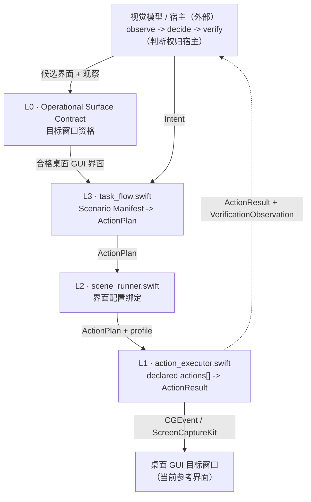

# visual-agent 桌面 GUI 参考运行时

这个目录是 **visual-agent** 的第一个参考运行时。它把根目录的
L0/L1/L2/L3 契约实例化到桌面 GUI 可操作交互界面上。

项目边界不是这个目录。项目边界是根文件定义的协议优先交互界面、运行时和说明体系：

- `../../AGENTS.md`
- `../../README.md`
- `../../README.zh-CN.md`

这个运行时用软件窗口证明协议，但不把 visual-agent 限定成软件窗口项目。浏览器、移动端、物理面板
和简单具身控制运行时后续可以通过适配器或拆分项目继承同一套 L0/L1/L2/L3 契约。

## 运行模型

视觉模型 / 宿主负责智能循环：

```text
observe -> decide -> act -> verify
```

这个运行时负责这个循环周围的桌面 GUI 动作边界：

- 将一个桌面 GUI 窗口确认成 L0 可操作交互界面；
- 通过 `action_executor.swift` 暴露 L1 运行时能力手册；
- 通过桌面 GUI `profile.json` 绑定 L2 交互界面说明书；
- 通过 `manifest.json` 展开 L3 场景需求；
- 输出机器可读 JSON 结果和错误；
- 永远不判断任务成功。

`ActionResult.ok == true` 只表示运行时边界已经派发或完成声明动作，不表示任务成功。任务成功只能由
宿主基于新的观察判断。

## 四层结构

| 层 | 契约 / 说明书 | 桌面 GUI 参考产物 |
|---|---|---|
| L0 | 可操作交互界面契约（Operational Surface Contract） | 一个有边界的目标应用窗口，以及声明过的观察参考系、安全包络和验证预期。 |
| L1 | 运行时能力手册（Runtime Capability Manual） | `../../protocol/L1-runtime-capability-manual.md`、`src/action_executor.swift` |
| L2 | 交互界面说明书（Surface Manual） | `../../protocol/L2-surface-manual.md`、`src/scene_runner.swift`、`examples/*/profile.json` |
| L3 | 场景需求（Scenario Requirements） | `../../protocol/L3-scenario-requirements.md`、`src/task_flow.swift`、`examples/*/manifest.json` |

`Target Application`、`Target Window`、`Target Profile`、`AppObservation` 和 `windowTopLeft`
这些名称是当前桌面 GUI 参考运行时的术语，不是 visual-agent 的完整项目词汇。

## 架构



闭环仍然是：

```text
observation -> ActionPlan -> ActionResult -> fresh VerificationObservation -> host judgement
```

交互界面专属知识只放在配置、清单和实例文档里，不写进运行时引擎。新增桌面 GUI 参考界面
应优先是数据和文档，不是新增通用运行时代码。

## 目录结构

```text
runtimes/desktop-gui/
  src/
    action_executor.swift
    scene_runner.swift
    task_flow.swift
  examples/
    reference-surface/
      profile.json
      manifest.json
      L2-surface-manual.md
      L3-scenario-requirements.md
  scripts/
    build.sh
    smoke.sh
```

## 面向智能体的文档

- `../../protocol/README.md` 是面向智能体的协议地图，负责把根契约、L0/L1/L2/L3 规格、
  运行时、示例、集成、适配器和不变量连接起来。
- 每个 `src/*.swift` 顶部都有 `AGENT BINDING BLOCK`，把代码符号指向协议章节。运行时引用
  协议；协议不从代码反推。

如果行为必须变化，先改协议章节，再改实现。如果本 README 和根文件的产品范围冲突，根文件优先。

## 新增一个桌面 GUI 参考界面

1. 先确认目标窗口满足 L0：有边界、可观察、有声明式动作通道、有安全包络、有新的观察验证路径。
2. 在 `examples/` 或自定义位置创建一个界面目录。
3. 写 `profile.json`，作为桌面 GUI 界面配置，包含 `bundleID`、`ownerNames` 和 `appLabel`。
4. 写 L2 交互界面说明：可观察状态、安全目标或控件类型、状态到动作计划的映射、验证信号、
   动作允许 / 禁止列表。
5. 写 `manifest.json`，作为当前桌面 GUI 场景清单，声明 `profile` 和 `intents` 字段映射。
6. 可选：补写 L3 场景说明，参考 `examples/reference-surface/`。
7. 用 `preview-json` 校验每个任务意图。

如果只是新增界面配置、说明文档和清单，不需要改任何运行时源码。

## 用法

从 `runtimes/desktop-gui/` 目录运行：

L1 - 通过环境变量注入目标配置并执行动作计划：

```bash
VISUAL_APP_BUNDLE_ID=<id> VISUAL_APP_LABEL=<label> \
  swift src/action_executor.swift run-plan '<action_plan_json>'
```

L2 - 使用桌面 GUI 界面配置文件运行：

```bash
swift src/scene_runner.swift --profile examples/reference-surface/profile.json diagnose
```

L3 - 针对清单预览、计划或执行一个任务意图：

```bash
swift src/task_flow.swift --manifest examples/reference-surface/manifest.json \
  preview-json '{"intent":"openTargetCapture","x":480,"y":120,"output":"out/c.png","dryRun":true}'
```

## 验证

从 `runtimes/desktop-gui/` 目录运行：

```bash
swiftc -typecheck src/action_executor.swift
swiftc -typecheck src/scene_runner.swift
swiftc -typecheck src/task_flow.swift
bash scripts/smoke.sh
```

从仓库根目录运行：

```bash
swiftc -typecheck runtimes/desktop-gui/src/action_executor.swift
swiftc -typecheck runtimes/desktop-gui/src/scene_runner.swift
swiftc -typecheck runtimes/desktop-gui/src/task_flow.swift
bash runtimes/desktop-gui/scripts/smoke.sh
```

期望 smoke 输出：`SMOKE_OK`。

## 集成

宿主可以通过 `../../integration/host-embedding.md` 把这个运行时嵌入智能体、工作流引擎或服务。
边界保持不变：

- 宿主负责观察解释、决策、审批和任务成功判断；
- 运行时和适配器只暴露声明式能力与机器可读结果；
- 适配器只映射传输层或运行时后端，不调用模型；
- 安全审批显式发生；
- 失败必须机器可读。

已实现的适配器分层位于 `../../adapters/`：

```text
T0  核心运行时边界      -> integration/host-embedding.md + runtimes/desktop-gui/src/*
T1  tool-calling 适配器 -> adapters/tool-calling/
T2  workflow 适配器     -> adapters/workflow/
```

未来的服务 / MCP 适配器说明位于 `../../docs/future-adapters/mcp-service.md`；它不是当前已实现的适配器分层。

## 约束

- 保持 observe -> decide -> act -> verify 循环。
- 显式处理 L0 界面资格，不把它藏进 L1、L2、运行时代码或适配器。
- 具体应用、网站、设备工作流不进入通用运行时代码。
- 交互界面专属知识放在配置、清单和实例文档中。
- 不把 `ActionResult.ok == true` 当作任务成功。
- 失败必须机器可读。
- 安全审批必须显式路由。
- 桌面 GUI 术语只作为参考运行时术语使用。
